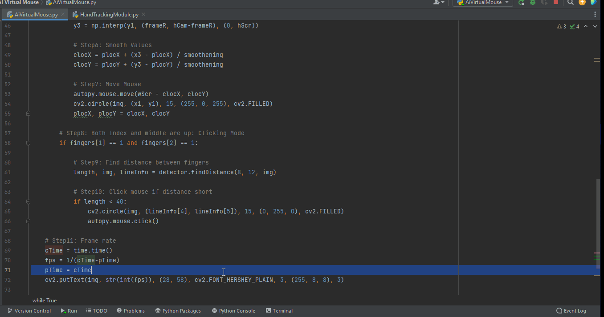

# AI Virtual Mouse

Created a Virtual Mouse Tool which can be used to click and select different apps and also has the ability to change the system's configurations like volume and brightness using OpenCV and Mediapipe. It mainly recognizes finger patterns and analyzes them.

**Virtual Mouse** is a python software which is designed to detect hand movements and patterns. This can help to play with system's settings and wouldn't need a physical mouse or mousepad😅.

Submitted by: **Devansh Goel**

Time spent: **2** days spent in total

## User Stories

The following **required** functionality is completed:

* [x] Program can **Analyze user hand movements**
* [x] Program can **Detect different hand patterns**
* [x] Program can **Switch within different folders and apps**
* [x] Program can **Change the settings of the system by fingers** 
* [x] Program can **Can close or open different applications without the use of physical mouse or keyboard** 
* [x] User can **See the current FPS on the right top of the screen**
* [x] User can **safely exit the program** 

## Video Walkthrough

Here's a walkthrough of implemented user stories:

GIF created with [LiceCap](http://www.cockos.com/licecap/).

## Notes

It was great to use different libraries like opencv, tensorflow, mediapipe, pycaw and my very own **personal hand detection file.**

## License

    Copyright [2021] [Devansh]

    Licensed under the Apache License, Version 2.0 (the "License");
    you may not use this file except in compliance with the License.
    You may obtain a copy of the License at

        http://www.apache.org/licenses/LICENSE-2.0

    Unless required by applicable law or agreed to in writing, software
    distributed under the License is distributed on an "AS IS" BASIS,
    WITHOUT WARRANTIES OR CONDITIONS OF ANY KIND, either express or implied.
    See the License for the specific language governing permissions and
    limitations under the License.
